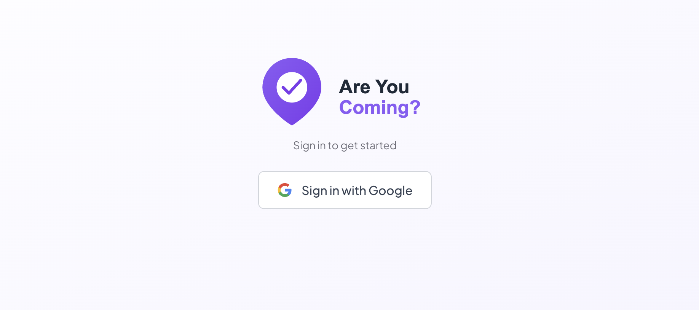

# Are You Coming?

A simple event planning app. Create events, share them with friends, and let them RSVP. It comes with a live countdown, attendee list, and calendar view to keep everything organized.

## Tech Stack

- **[Next.js](https://nextjs.org)** — App Router, server and client components
- **[TypeScript](https://www.typescriptlang.org)** — type safety throughout
- **[PostgreSQL](https://www.postgresql.org)** via **[Neon](https://neon.tech)** — serverless database
- **[NextAuth v5](https://authjs.dev)** — Google OAuth authentication
- **[Tailwind CSS](https://tailwindcss.com)** — styling
- **[Lucide React](https://lucide.dev)** — icons
- **[Vercel](https://vercel.com)** — deployment

## Features

- Google sign-in
- Create events with a name, date, description, and optional image
- Share event pages with guests — no account required to RSVP
- Live countdown timer on each event
- Attendee list with email reminders
- Calendar view with events highlighted on the right days
