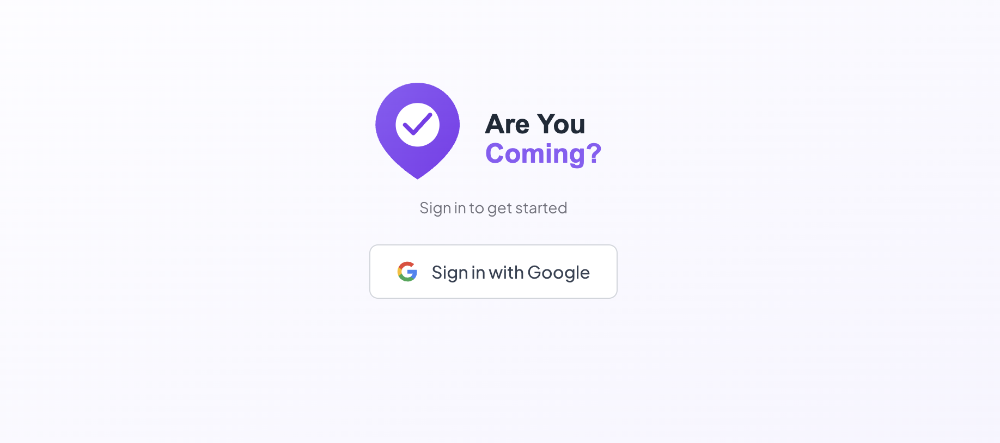
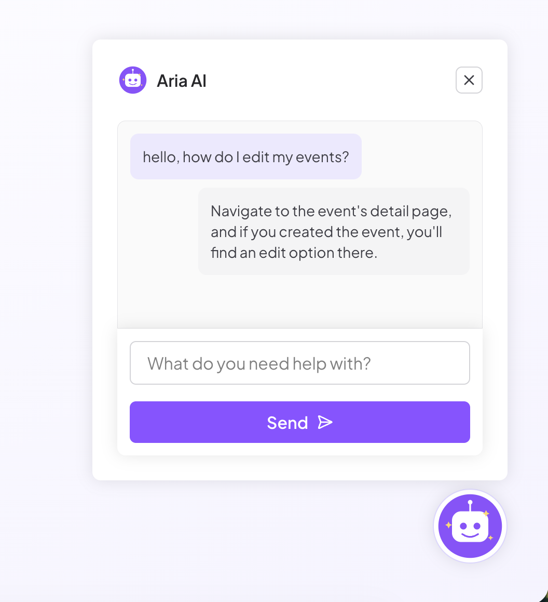

# Are You Coming?

A simple event planning app. Create events, share them with friends, and let them RSVP. It comes with a live countdown, attendee list, and calendar view to keep everything organized. The project is intentionally built with a minimal dependencies. If something can be built without a library, it is.

## Tech Stack

- **[Next.js](https://nextjs.org)** — App Router, server and client components
- **[TypeScript](https://www.typescriptlang.org)** — type safety throughout
- **[PostgreSQL](https://www.postgresql.org)** via **[Neon](https://neon.tech)** — serverless database
- **[NextAuth v5](https://authjs.dev)** — Google OAuth authentication
- **[Tailwind CSS](https://tailwindcss.com)** — styling
- **[Lucide React](https://lucide.dev)** — icons
- **[Vercel](https://vercel.com)** — deployment
- **[Google Gemini 2.5 Flash](https://deepmind.google/technologies/gemini/)** — primary AI model
- **[Groq](https://groq.com)** (Llama 3.3 70B) — AI fallback

## Features

- Google sign-in
- Create events with a name, date, description, and optional image
- Share event pages with guests — no account required to RSVP
- Live countdown timer on each event
- Attendee list with email reminders
- Calendar view with events highlighted on the right day. Built from scratch, no calendar library.
- AI assistant (Aria) for event planning help and app navigation
- Inline AI suggestions for event name and description fields directly in the form
- Spotify playlist embed with QR code and collaborator invite link on each event page

## AI — Aria

Aria is a context aware AI assistant built into the app, powered by **Google Gemini 2.5 Flash** with automatic fallback to **Llama 3.3 70B via Groq** if the primary model is unavailable.

Aria operates in two modes:

**Conversational assistant** — accessible from the dashboard, Aria answers event planning questions and guides users through the app. It has full awareness of the app's routes, features, and navigation patterns, allowing it to give precise, app-specific answers rather than generic responses.

**Inline field assistant (MiniAssistant)** — embedded directly inside the event creation and edit forms, next to the name and description fields. The model is given a field-scoped system prompt that instructs it to return only the suggested text, with no explanation or alternatives. The output is injected directly into the form field, ready to use.

## Spotify Integration

Each event supports an optional Spotify playlist link. When provided, the event detail page embeds the playlist directly using the Spotify iFrame API. No redirects, no third-party wrappers, just the embed URL parsed from the playlist link.

If a collaborator invite URL is also set, guests are shown a QR code generated client-side that encodes the invite link, alongside a direct join button. Scanning the code or clicking the button adds them as a collaborator on the playlist, so attendees can contribute to the event soundtrack before they even arrive.
